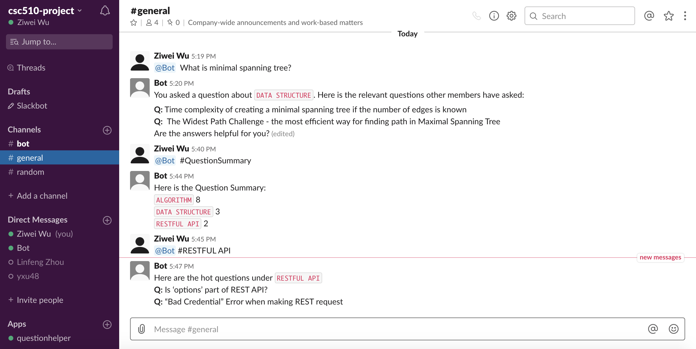

# Problem Statement

Group chatting and discussion activity are necessary for collaboration in a team project. Chatting applications such as slack, mattermost are popular platform for those communication. Team members can launch a lot of activities in slack or mattermost, including sending messages in a public or private channel, searching previous messages, and marking posts .etc. In this project we focus on solving a question- response problem using AI techniques based on the questions we asked to the Bot in Slack channel. 
  
The intuition behind this goal is that, during the usage of Slack, a problem that always bothers users is that it is hard to find relevant information that we want to find in hundreds or thousands of messages and the topic of these messages are mixed. Although we can use the search functionality to search keywords and find those relevant information, we are still bothered by a lot of redundant information. It is highly inefficient for users to search those relevant information since it results in misguided information from inaccurate points of contact. To reduce such issue and the time lost by searching relevant information iteratively, some functionality should be developed to help improve communication efficiency of this procedure. 
  

# Bot description

We aim to develop a QuestionHelperBot that can help users with their questions and provide with most relevant information about their questions. The Bot maintains a set of questions asked in history by group members. When user asks some questions in a channel and wants the bot to help with relevant information about the question, he/she could tag the bot for help. Once it is tagged along with the question, the bot could first recognize the question category and return relevant questions within the same category asked by other members. In this way, the bot could help filter irrelevant information and provide with most useful content. If the user couldn’t be satisfied with information from Bot’s reply, they could notify bot and request for more help. In this case, bot will help to search from online resources such as stack overflow and return relevant questions. Moreover, the QuestionHelperBot can help summarize historical questions asked in the group chatting and provides with clear overview about it. The bot return question statistics and popular questions in each category. Users can have an insight about what are popular questions and concerned topics by group members with the help of the Bot. 

# Use case
### Use case 1: User asks a question, bot classify the question and get the related tag
 **1) Preconditions:**
 
User is a member of the group chatting and Bot is tagged along with the question.

 **2) Main Flow:**
 
The user asks a question[S1]. Bot asks whether the user is asking a question[S2]. Bot replies with the question category and relevant questions on Stack Overflow[S3] and asks whether the user needs to find a solution on Stack Overflow[S4].

 **3) Subflows:**
 
[S1] User asks a question. (On general channel or private channel) 

[S2] Bot asks the user if he/she is asking a question.

[S3] Bot assigns a question category to the asked question through a classification model and return the category with relevant questions.

[S4] Bot asks the user whether he/she needs to search the solution in Stack Overflow

 **4) Alternative Flows**
 
[E1] There is no recognized category in database. No relevant questions returned.

[E2] User is asking a question

### Use case 2: User questions are redirected to Stack Overflow to find answers 
**1) Preconditions**

The provided relevant questions are not helpful for users.

**2) Main Flow**

User asks the QuestionHelperBot[S1] to find the solutions on Stack Overflow[S2].

**3) Subflows**

[S1] User provides the request he/she wants more information not only what has been discussed within the Slack channel.

[S2] QuestionHelperBot will return the link of Stack Overflow based on the relevance.

**4) Alternative Flows**

[E1] The requested category doesn’t exist in the list which the bot provides and return the “cannot find” message, then it is prompted to try again.

### Use case 3: Return questions summary
**1) Preconditions**

 Bot and ‘QuestionSummary’ label is tagged by user.
 
**2) Main Flow**

 User asks the Bot to provide question summary[S1]. QuestionHelperBot will return the number of questions asked today and their titles[S2].
 
**3) Subflows**

[S1] User asks Bot to provide question summary.

[S2] Bot return the number of questions and titles.

# Design Sketch
### Wireframe
We will implement our bot in Slack platform. The interactions between user-end and bots happen in Channels. Bot will give a response when it is tagged. 

### StoryBoard
* Scenario 1: User ask question, bot replies with question category and relevant questions

* Scenario 2-- User asks question but not satisfied with current provided information.

* Scenario 3: User ask for question summary

* Scenario 4: User ask for hot questions on a specific category.

# Architecture Design
### Architecture Diagram
The following diagram depicts the architectural components and movement descriptions in our bot design. 

### Architectural Components:
* User: These are slack channel users who are working towards a particular project in group chats or private communications.
* Slack: Slack is a collaboration platform that allows users discussing and making decisions through public or private channels. Besides the communication between users, there is also a chatbot in Slack that can be a resource used by users by tagging it. Users can trigger the bot for interaction. 
* Slack SDK: Slack also provides its own SDK, which includes a variety of APIs for developers to implement new functionalities. We will use these APIs to develop our QuestionHelper functionalities. 
* AI Trained Model: This is a model which is trained using relevant training data using AI algorithms. In our bot applications, there are a variety of AI model in use, there is a classification AI model used to classify different categories depending on users’ questions and there might be also an AI translation mode used to translate different languages to English but this functionality is optional in our bot applications. We will first solve the classification problem. 
* Message Server: There is a server to handle messages sent in Slack channels. The server is the most important component in our bot applications. Basically it handles messages sent by users in Slack channel, and return results back to users through Slack web APIs (in the SDK). It also runs interfaces with StackOverflow if there is no appropriate answers of users’ questions and get back relevant information regarding to users’ questions. 
* StackOverflow: StackOverflow is a question-answer site for programmers. It contains a wide range of questions and answers about computer programming.  If the server cannot answer users’ questions appropriately, then it will use StackOverflow as a third-party resource.

### Guidelines and Constraints

There are a few contraints in the bot application:

* Bot can not directly provide an answer if not asked. It can only fetch answers that are previously answered or the question statistics or answers found on stack overflow if needed.
* The bot can only be activated through tagging.
* Directed messages to bot is not supported. The bot will only detect messages in public channels. 
* The question categories provided by model is limited. The recommended relevant questions might not highly related. 
* Only particular users are allowed to get question statistics report.
* The channel is private. No member can join without approval.
* Users can only demand for related question summary or answers provided before.

